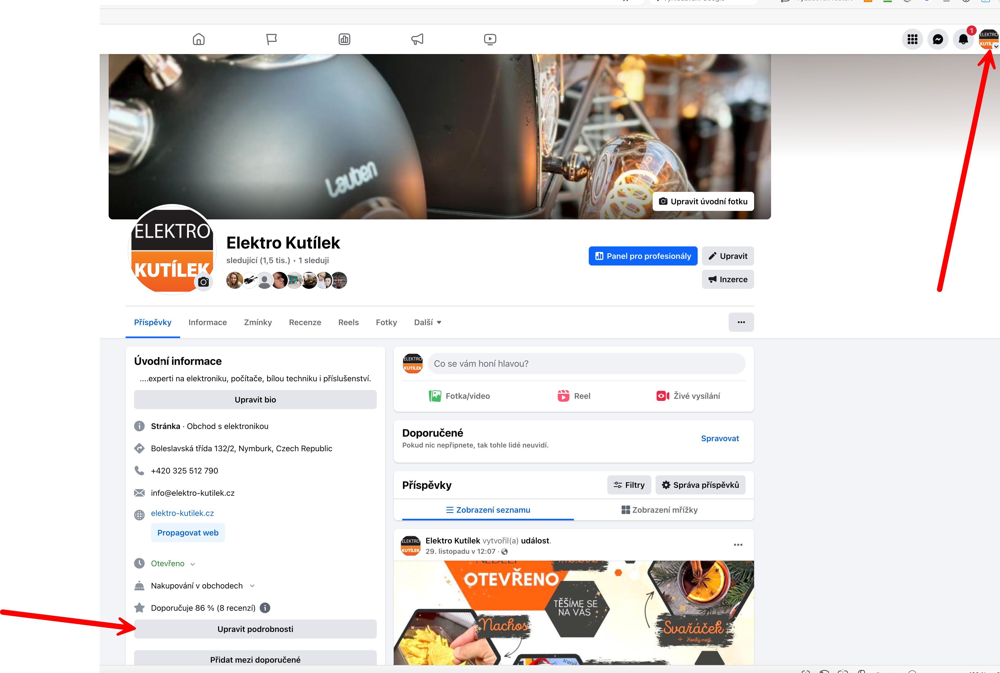
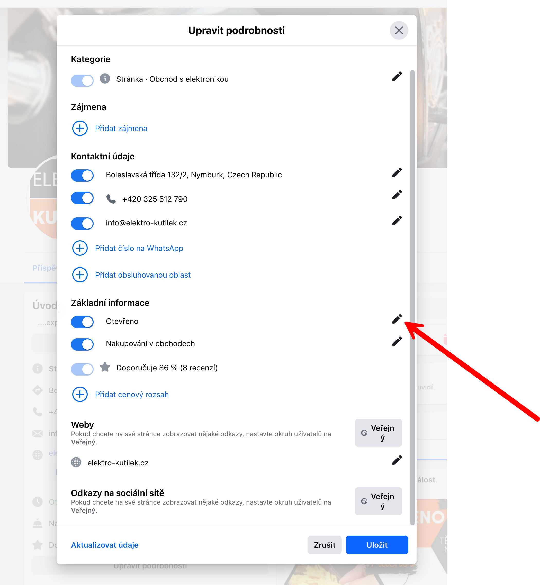
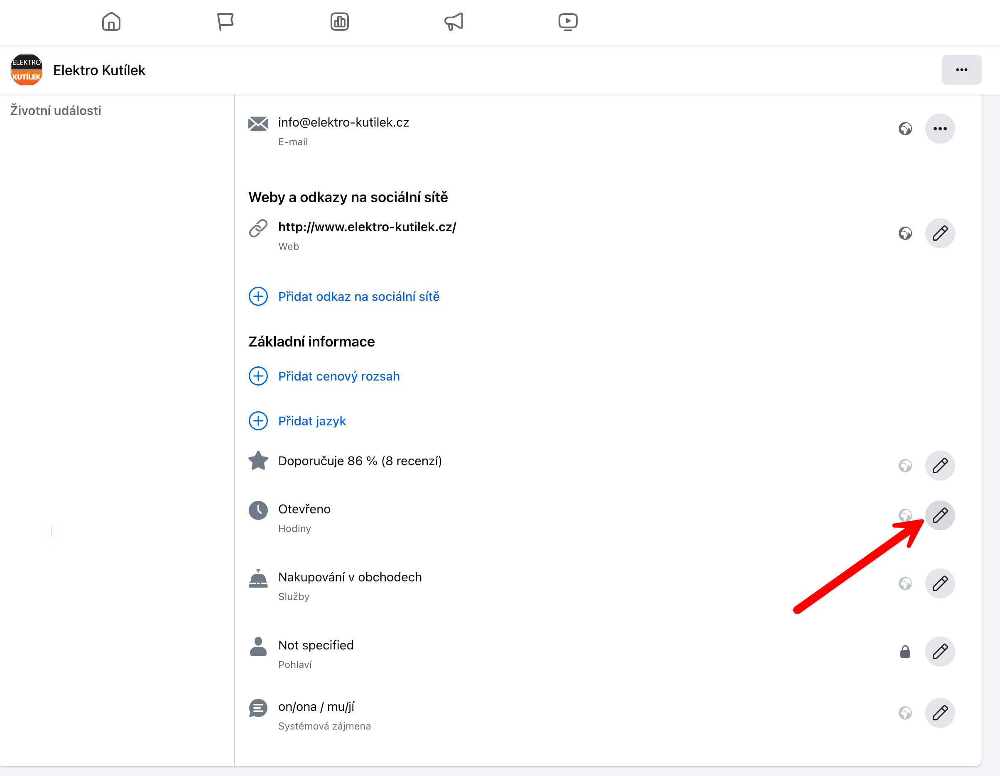
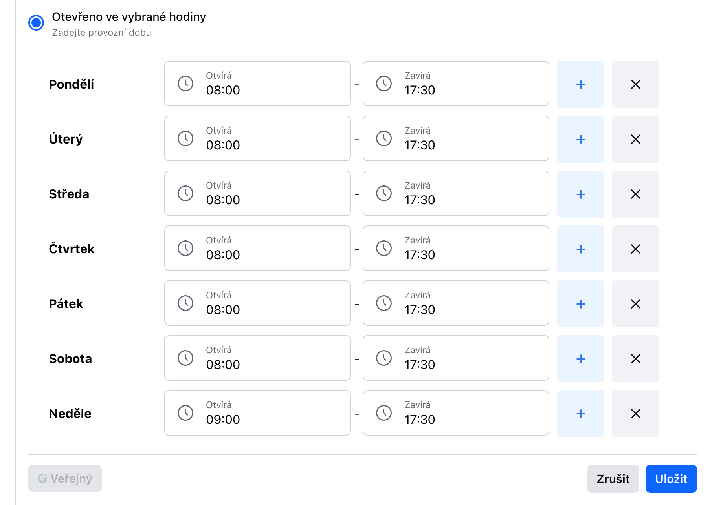
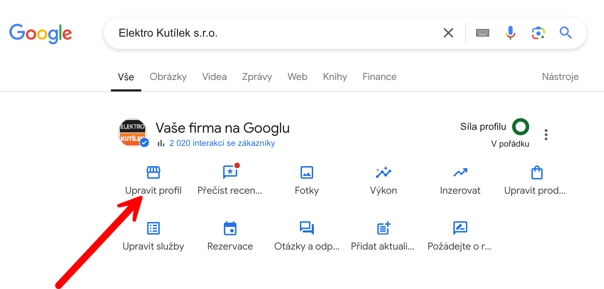
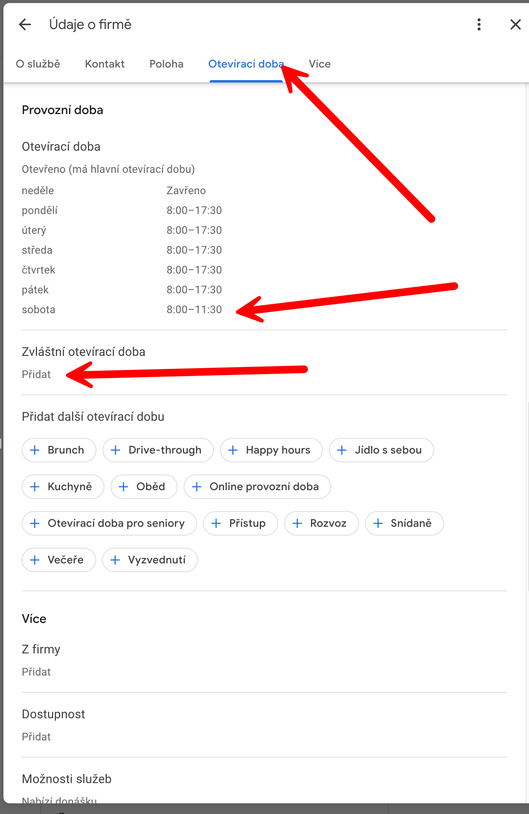
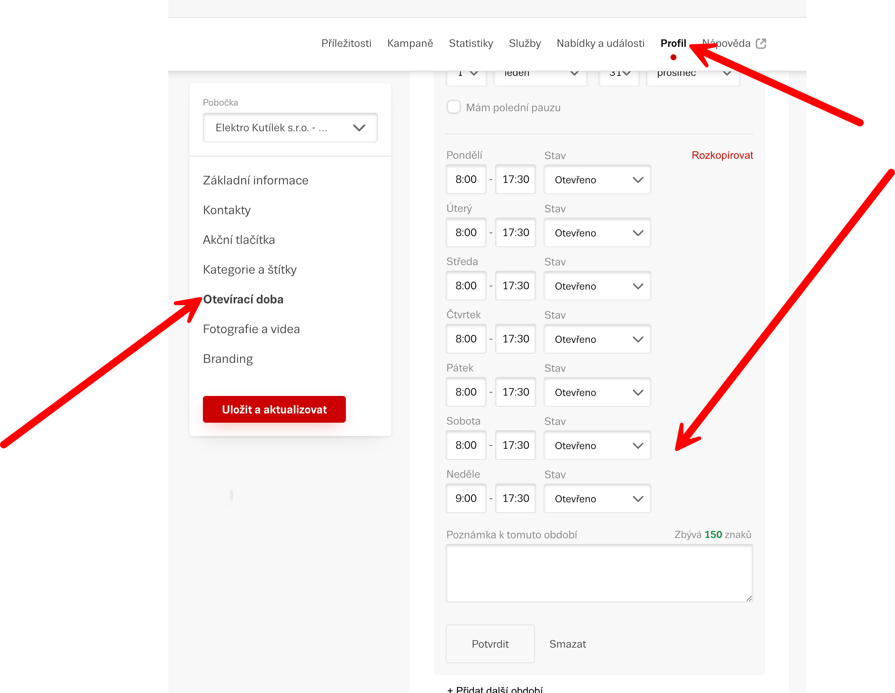
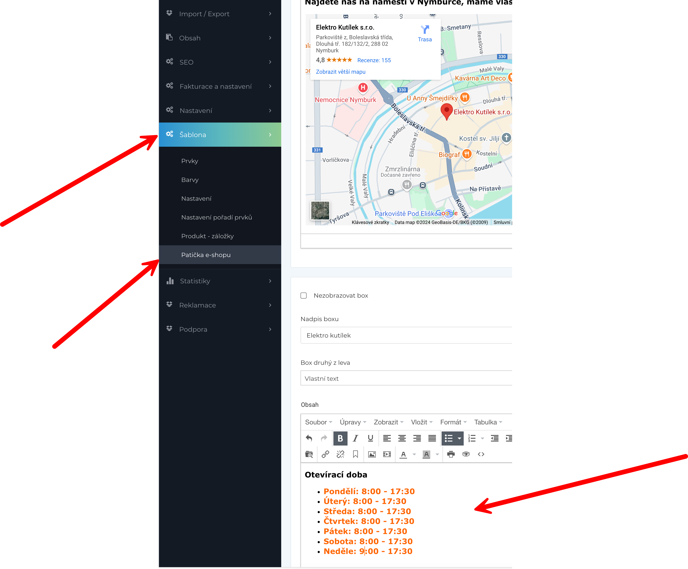

# 🔧 Změna otevírací doby na webech

> **Kdo:** back office asistent prodeje (do přidělení role: vedoucí provozu)
> **Kdy:** při změně otevírací doby (vánoční období, mimořádné události)
> **Kde:** Facebook, Google, Seznam Firmy, web 404.cz + fyzická cedule na dveřích

:::warning
Při změně otevírací doby musíš aktualizovat **všech 5 míst**. Pokud zapomeneš na jedno, zákazník najde nesprávnou informaci. Po skončení výjimky musíš vše **vrátit zpět**.
:::

## ✅ Checklist

Při každé změně odškrtni, že jsi aktualizoval:

**Změněná otevíračka:**
- [ ] Facebook
- [ ] Google
- [ ] Seznam (Firmy)
- [ ] Web (404.cz)
- [ ] Cedule na dveřích

**Vrácená otevíračka (po skončení výjimky):**
- [ ] Facebook
- [ ] Google
- [ ] Seznam (Firmy)
- [ ] Web (404.cz)
- [ ] Cedule na dveřích

---

## 📘 Facebook

**URL:** [facebook.com/elektrokutilek](https://www.facebook.com/elektrokutilek/)

### Krok 1: Otevři profil a klikni na „Upravit podrobnosti"

Na hlavní stránce profilu Elektro Kutílek dole vlevo najdi tlačítko **Upravit podrobnosti**.

### Krok 2: V dialogu najdi „Otevřeno" a klikni na tužku

V dialogu **Upravit podrobnosti** scrolluj dolů do sekce **Základní informace**. U položky **Otevřeno** klikni na ikonu tužky vpravo.

### Krok 3: Na nové stránce najdi „Otevřeno — Hodiny" a klikni na tužku

Otevře se stránka s detaily profilu. Najdi řádek **Otevřeno — Hodiny** a klikni na ikonu tužky vpravo.

### Krok 4: Uprav hodiny a ulož

Ve formuláři změň otevírací dobu per den. Při vánoční výjimce nastav sobotu a neděli na rozšířenou dobu. Klikni **Uložit**.

:::warning
Facebook někdy resetuje změny — po uložení **ověř**, že se nová doba zobrazuje na veřejném profilu. Otevři profil v anonymním okně a zkontroluj.
:::

**Výsledek:** Na Facebooku svítí aktuální otevírací doba.

---

## 📗 Google

**URL:** Vyhledej „Elektro Kutílek s.r.o." na [google.com](https://www.google.com/search?q=Elektro+Kut%C3%ADlek+s.r.o.)

### Krok 1: Klikni na „Upravit profil"

Po vyhledání se zobrazí panel **Vaše firma na Googlu**. Klikni na **Upravit profil**.

### Krok 2: Přejdi na záložku „Otevírací doba" a uprav

V editoru profilu klikni na záložku **Otevírací doba**. Uprav hodiny per den. Pro vánoční výjimky použij sekci **Zvláštní otevírací doba → Přidat**.

:::tip
Google má funkci **Zvláštní otevírací doba** — tam můžeš zadat konkrétní datumy (např. 24.12. zavřeno, adventní neděle 9:00–17:30) bez toho, abys měnil standardní hodiny. Po skončení období se automaticky vrátí na standard.
:::

**Výsledek:** Na Google Maps a ve vyhledávání svítí aktuální otevírací doba.

---

## 📙 Seznam Firmy

**URL:** [admin.firmy.cz/sprava-firmy/edit/644732](https://admin.firmy.cz/sprava-firmy/edit/644732)

**Přihlášení:** kompost23@seznam.cz

### Krok 1: V menu vlevo klikni na „Profil" → najdi „Otevírací doba"

Po přihlášení do administrace jdi do sekce **Profil**. Najdi blok **Otevírací doba** a uprav hodiny per den. U neděle nastav buď „Zavřeno" nebo otevírací dobu (vánoční režim: 9:00–17:30). Klikni **Uložit a aktualizovat**.

**Výsledek:** Na Firmy.cz svítí aktuální otevírací doba.

---

## 🌐 Web (404.cz)

### Krok 1: V administraci jdi do Šablony → Patička e-shopu

Přihlas se do administrace 404.cz. V levém menu klikni na **Šablony** → **Patička e-shopu**. V editoru najdi blok **Otevírací doba** a ručně přepiš text s hodinami.

:::warning
Na webu se otevírací doba mění **ručně v textu** — žádný formulář. Dávej pozor na formátování (každý den na novém řádku, tučně hodiny).
:::

**Výsledek:** Na webu elektro-kutilek.cz v patičce svítí aktuální otevírací doba.

---

## 🪧 Cedule na dveřích

### Při vánoční výjimce:

1. **Najdi šablonu** — grafický soubor na Synology disku (TODO: přesná cesta)
2. **Uprav hodiny** — otevři v grafickém editoru, přepiš na vánoční dobu
3. **Vytiskni na A3** — barevně
4. **Zalaminuj** — laminovačka je v back office
5. **Vyvěs na správné místo** — hlavní vstupní dveře, na úrovni očí, vedle standardní cedule

:::danger
Zkušenost: každý to vyvěsí jinam. Cedule patří na **hlavní vstupní dveře, vpravo, na úrovni očí**. Ne na výlohu, ne do rohu, ne na postrání vchod.
:::

### Po skončení výjimky:

1. **Sundej vánoční ceduli**
2. **Zkontroluj**, že standardní cedule je stále na místě a čitelná

---

## ⚠️ Časté chyby

- ❌ Zapomenout na jednu platformu → ✅ Používej checklist nahoře, odškrtávej každou zvlášť
- ❌ Zapomenout vrátit zpět po skončení výjimky → ✅ Nastav si připomínku na datum konce výjimky
- ❌ Vyvěsit ceduli na špatné místo → ✅ Hlavní dveře, vpravo, úroveň očí
- ❌ Neověřit po uložení na Facebooku → ✅ Otevři profil v anonymním okně a zkontroluj

## 🔗 Souvisí

- [📜 Otevírací doba — pravidla](./oteviraci-doba-bimg) — kompletní pravidla, tabulka svátků
