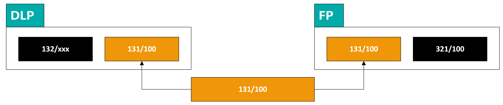
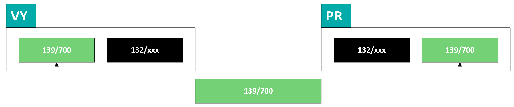

# 💡 131 — Saldokonto sklady

## Proč to tak je

Když přijde zboží od dodavatele, vznikne dodací list přijatý (DLP). Faktura přijatá (FP) dorazí později — někdy za den, někdy za týden. Účet 131/100 hlídá, že ke každému DLP nakonec dorazí FP. Dokud nedorazí, položka „visí" — a to je v pořádku, pokud ne déle než 1–2 týdny. Pokud visí déle, je třeba urgovat dodavatele.

Stejný princip platí pro reklamační (DLPR) a vratkové (DLPV) dodací listy — tam čekáme na dobropis (DBP). Tolerance je delší (max 2 měsíce), protože dobropisy chodí pomaleji.

Účet 139/700 je jednodušší — páruje skladové převody mezi sklady (výdejka vs příjemka).

:::info Tolerance visení
DLP visí běžně 1–2 týdny (čeká se na FP od dodavatele). DLPR/DLPV mohou viset až 2 měsíce (dobropisy chodí pomaleji). Cokoliv nad tyto limity = urgovat dodavatele.
:::

## Jak to funguje

### 131/100 — párování mezi DLP a FP

Diagram ukazuje princip: DLP má kontaci 132/xxx (sklad) + **131/100** (saldokonto). FP má kontaci **131/100** + 321/100 (závazek). Saldokontní účet 131/100 je společný — když si VS a partner sednou, položky se spárují a zmizí.

| | |
|---|---|
| **Co páruje** | DLP / DLPR / DLPV vs FP1 / FP3 |
| **Požadovaný stav** | Visí pouze DLP z posledních 1–2 týdnů. DLPR/DLPV max 2 měsíce |
| **Typické chyby** | Na DLPx chybí VS · Záměna VS dodáku a VS faktury · Visí položka co se má fakturovat — zaurgovat dodavatele |
| **Frekvence** | Týdenní kontrola |

:::warning
VS má být číslo výdejky. Nejčastější chyba: na jedné straně je VS dodáku, na druhé VS faktury — to se nespáruje.
:::

---

### 139/700 — skladové převody

Převodka mezi sklady generuje dva doklady: výdejku s kontací **139/700** + 132/xxx a příjemku s kontací 132/xxx + **139/700**. Kontroluje se v rámci denního salda.

| | |
|---|---|
| **Co páruje** | Výdejka (VY) vs příjemka (PR) |
| **Požadovaný stav** | Nulový — oba doklady vznikají současně |
| **Frekvence** | Denní kontrola (součást rutiny) |

:::danger 139/700 nesmí nikdy viset
Oba doklady (výdejka + příjemka) vznikají současně. Pokud 139/700 visí, je to systémový problém — nedokončená převodka v Money. Řešit okamžitě.
:::

---

## Zkušenosti a poučení

- Pokud na 131/100 visí DLPR déle než 2 měsíce → urgovat dodavatele, delší čekání na dobropis není normální
- Chyba ve VS se snadno přehlédne — pomáhá filtrovat na „nespárované starší než X dnů"
- 139/700 by nikdy neměl viset — pokud visí, je to systémový problém (nedokončená převodka)

## 🔗 Souvisí

- [Saldokonto — přehled](./saldokonto-bimg) — kontext, frekvence, odpovědnosti
- Fakturace FP (TODO) — postup generování faktur přijatých z DLP
