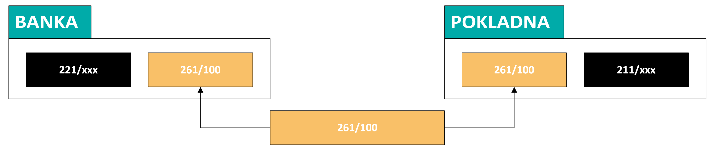
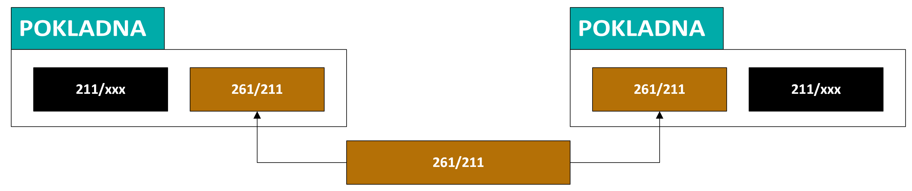
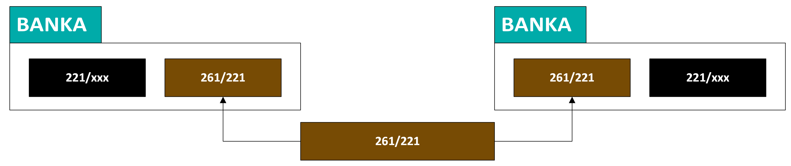

# 💡 261 — Saldokonto převody

## Proč to tak je

Každý den se peníze fyzicky přesouvají: z prodejních pokladen do hlavní pokladny P0, z P0 do banky, mezi bankovními účty. Každý takový přesun generuje **dva doklady** — výdaj na jedné straně, příjem na druhé. Skupina 261 hlídá, že si tyto dvě strany odpovídají.

Pokud 261 nesvítí, znamená to, že někde v řetězci „pokladna → P0 → banka" se ztratil doklad nebo nesedí VS. Všechny tři účty se kontrolují denně — problém v převodu tržeb musí být odhalen tentýž den.

:::warning Denní kontrola — všechny 3 účty
Celá skupina 261 se kontroluje denně. Po načtení banky musí být všechny tři účty nulové. Pokud ne, oprav VS ještě tentýž den.
:::

## Jak to funguje

### 261/100 — odvody tržeb do banky

Když se z hlavní pokladny P0 odvedou tržby do banky, vznikne výdajový pokladní doklad (P0) a příjmová položka na bankovním výpisu. Obě strany se párují přes 261/100.

| | |
|---|---|
| **Co páruje** | Pokladní doklady P0 výdajové vs příjmové položky bankovních výpisů |
| **Požadovaný stav** | Po načtení banky denně nulový |
| **Typický postup** | Na BV se opraví VS podle pokladny |
| **Typické chyby** | Neshoda VS · Přesmyčka v částce |
| **Frekvence** | Denní kontrola |

:::tip Oprava VS
Na BV se opraví VS podle pokladního dokladu — pokladna je „zdroj pravdy" pro VS u odvodů tržeb.
:::

---

### 261/211 — převody mezi pokladnami

Když se tržby odvádějí z prodejní pokladny (P1–P3) do hlavní pokladny P0, vznikne výdajový doklad na jedné pokladně a příjmový na druhé. Párují se přes 261/211.

| | |
|---|---|
| **Co páruje** | Pokladní doklady na jedné pokladně vs pokladní doklady na druhé |
| **Požadovaný stav** | Denně nulový |
| **Typický postup** | Na příjmovém dokladu se doplní VS podle výdajového |
| **Typické chyby** | Neshoda VS · Přesmyčka v částce |
| **Frekvence** | Denní kontrola |

---

### 261/221 — převody mezi bankami

Převod mezi dvěma bankovními účty firmy. VS se přenáší automaticky, obvykle se jen kontroluje IČ partnera.

| | |
|---|---|
| **Co páruje** | Bankovní doklady na jednom našem účtu vs bankovní doklady na druhém |
| **Požadovaný stav** | Denně nulový |
| **Typický postup** | VS se přenáší sám, kontroluje se IČ |
| **Typické chyby** | Nebyl natažený partner Elektro Kutílek s.r.o. s IČem (chyba VS je vyloučena — přenáší se automaticky) |
| **Frekvence** | Denní kontrola |

:::note 261/221 je nejspolehlivější
VS se přenáší automaticky mezi bankami — chyba je vzácná. Stačí kontrolovat, že se natáhl správný partner (Elektro Kutílek s.r.o. s IČem).
:::

---

## Zkušenosti a poučení

- Všechny tři účty 261 mají stejný nejčastější problém: **neshoda VS**. Řešení je vždy stejné — opravit VS na jedné ze stran podle druhé
- Přesmyčka v částce se stává výjimečně, ale je těžší k nalezení — pomáhá seřadit podle částky a vizuálně porovnat
- 261/221 je nejspolehlivější — VS se přenáší automaticky, chyba je vzácná
:::danger 261/211 — pozor na ruční VS
Při odvodu tržeb z prodejní kasy do P0 se VS přepisuje ručně — tady vzniká nejvíc chyb v celé skupině 261. Vždy zkontroluj VS na obou stranách.
:::

- 261/211 je nejčastější zdroj problémů — ruční přepisování VS při odvodu tržeb z kasy do P0

## 🔗 Souvisí

- [Saldokonto — přehled](./saldokonto-bimg) — kontext, frekvence, odpovědnosti
- Pokladna (TODO) — postup odvodů tržeb z kas do P0 a z P0 do banky
- Banka (TODO) — postup párování bankovních výpisů
- Denní uzávěrka tržeb (TODO) — generuje doklady, které se zde párují
