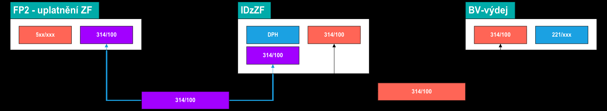

# 💡 314 — Saldokonto zálohy

## Proč to tak je

Zálohové faktury mají složitější životní cyklus než běžné faktury — záloha se nejdřív zaplatí, pak se uplatní (odečte od konečné faktury), a musí se vypořádat DPH interním dokladem. Účet 314 hlídá, že se všechny tři kroky dokončily a vzájemně sedí.

Pokud 314 visí, znamená to, že záloha byla zaplacena, ale nebyla uplatněna (nebo naopak), nebo že chybí interní doklad pro DPH.

:::note Tři kroky zálohy
Záloha má 3 fáze: zaplatit → vygenerovat ID pro DPH → uplatnit proti konečné faktuře. Pokud 314 visí, jeden z těchto kroků chybí.
:::

## Jak to funguje

### 314/201 — párování zálohových faktur

Diagram ukazuje tok ze tří stran:

1. **FP2 — uplatnění zálohy:** kontace 5xx/xxx (náklad) + **314/100** (saldokonto). Tímto se záloha „spotřebuje" proti konečné faktuře
2. **IDzZF — interní doklad:** řeší DPH ze zálohy. Kontace DPH + **314/100**. Generuje se automaticky nad uhrazenou ZFP
3. **BV výdej — úhrada z banky:** kontace **314/100** + 221/xxx. Původní platba zálohy na bankovním výpisu

Všechny tři doklady se párují přes společný účet **314/100**.

| | |
|---|---|
| **Co páruje** | Interní doklady na pokrytí ZF vs položky úhrad z banky |
| **Požadovaný stav** | Zůstávají zůstatky na již proplacených zálohovkách, které ještě nebyly uplatněny |
| **Typický postup** | Použít unikátní VS dle vzorce: `odběrné-místo-rok-měsíc` (např. 7569136600-2025-06) |
| **Typické chyby** | Neshoda VS |
| **Frekvence** | Měsíční kontrola |

:::tip
Interní doklad pro DPH ze zálohy lze vygenerovat **pouze pokud je ZFP uhrazená**. Pokud tlačítko nefunguje, zkontroluj stav úhrady na ZFP.
:::

---

## Zkušenosti a poučení

- Vzorec VS `odběrné-místo-rok-měsíc` zajišťuje unikátnost a zpětnou dohledatelnost — použij ho důsledně
:::danger Nejčastější chyba
Záloha zaplacena, ale nikdo nevygeneroval interní doklad pro DPH → visí na 314 do konce času. Tlačítko pro generování ID funguje jen pokud je ZFP ve stavu „uhrazená".
:::

- Nejčastější chyba: záloha zaplacena, ale nikdo nevygeneroval interní doklad → visí na 314 do konce času
:::info ČEZ a roční vyúčtování
Roční vyúčtování u dodavatelů se zálohovými fakturami (typicky ČEZ) je separátní postup — viz Roční vyúčtování ČEZ (TODO).
:::

- Roční vyúčtování u dodavatelů se zálohovými fakturami (typicky ČEZ) je separátní postup — viz Roční vyúčtování ČEZ (TODO)

## 🔗 Souvisí

- [Saldokonto — přehled](./saldokonto-bimg) — kontext, frekvence, odpovědnosti
- Zálohové faktury přijaté (TODO) — kompletní postup zpracování ZFP včetně generování ID
- Roční vyúčtování ČEZ (TODO) — specifický případ zálohových faktur
