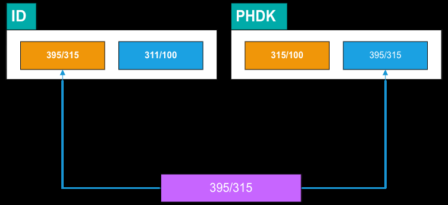
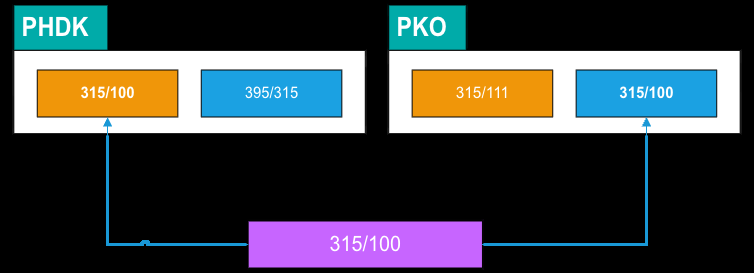

# 💡 315 — Saldokonto platební karty

## Proč to tak je

Když zákazník zaplatí kartou, peníze nedorazí na účet hned. Vznikne pohledávkový doklad (PHDK) v okamžiku platby, ale na bankovním výpisu se platba objeví až za 1–3 dny (po clearingu přes Wordline/PKO). Skupina 315 hlídá, že se tyto dva okamžiky propojí — že ke každé platbě kartou nakonec dorazily peníze na účet.

Navíc řeší specifický problém: PKO výpisy (z karetního terminálu) se liší od BV (bankovních výpisů) — čisté částky po poplatcích vs hrubé transakce. Účet 315/111 hlídá, že se převod čisté částky z PKO do banky správně spároval.

:::info Dva účty, dvě úrovně
315/100 páruje jednotlivé transakce (PHDK vs PKO). 315/111 páruje denní součty (převod čisté částky z PKO na BV). Oba se kontrolují denně.
:::

## Jak to funguje

### 315/100 — párování PK mezi PHDK a BV

Při platbě kartou na pokladně se vygeneruje pohledávkový doklad (PHDK) s partnerem = zákazník. Na PKO výpisu se objeví odpovídající položka. Párují se přes 315/100.

| | |
|---|---|
| **Co páruje** | Pohledávkové doklady (PHDK) s partnerem vs položky PKO výpisů |
| **Požadovaný stav** | Nebude nikdy nulový — ale nechceme různá IČ a vše by mělo viset jen z posledních 3–4 dnů |
| **Typický postup** | Páruje se jako úhrada z banky. Kontrola, že na sebe kromě úhrady sedl i partner |
| **Typické chyby** | Nesedí partner — automaticky se natáhne Wordline místo skutečného zákazníka |
| **Frekvence** | Denní kontrola |

:::warning
Při úhradě FV kartou se v PHDK automaticky dosadí Wordline jako partner. **Musíš ručně změnit na skutečného zákazníka** (partnera z FV). Jinak se 315/100 nespáruje správně.
:::

---

### 315/111 — párování převodů čistých částek z PKO na BV

PKO výpis obsahuje jako poslední položku převod čisté částky (po odečtení poplatků) na bankovní účet. Na BV se tato částka objeví jako příjem. Účet 315/111 páruje tyto dvě položky.

| | |
|---|---|
| **Co páruje** | Poslední převodová položka z PKO vs příjmová položka na BV |
| **Požadovaný stav** | Visí pouze poslední 3–4 výpisy. V pondělí sedí vše do nuly (weekend clearance) |
| **Typické chyby** | Nesedí VS (zůstal původní 82223474 místo aktuálního) |
| **Frekvence** | Denní kontrola |

:::tip Pondělní efekt
Přes víkend se clearují všechny transakce — v pondělí je 315/111 nulový. Během týdne visí poslední 3–4 výpisy, to je normální.
:::

---

## Zkušenosti a poučení

- **Partner na PHDK:** toto je nejčastější chyba v celé skupině 315. Při platbě FV kartou se automaticky dosadí Wordline — je nutné ručně přepsat na zákazníka. Pokud se to neudělá, saldokonto sice „visí", ale s nesprávným partnerem
- **Pondělní efekt u 315/111:** přes víkend se clearují všechny transakce, takže v pondělí je stav nulový. Během týdne visí 3–4 výpisy — to je normální
:::danger Historický VS 82223474
Tento starý VS se občas „zasekne" na převodech z PKO. Pokud na 315/111 visí položka s tímto VS → zkontroluj VS na PKO výpisu a opravu proveď na BV.
:::

- **VS 82223474:** historický VS, který se občas „zasekne" na převodech z PKO. Pokud visí, zkontroluj VS na PKO výpisu a opravu proveď na BV

## 🔗 Souvisí

- [Saldokonto — přehled](./saldokonto-bimg) — kontext, frekvence, odpovědnosti
- Banka (TODO) — PKO výpisy, párování, platební karty
- Úhrada FV kartou (TODO) — postup platby kartou s PHDK
