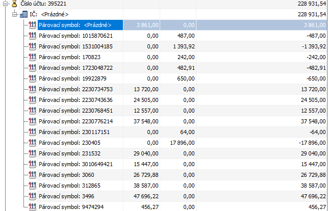

# 💡 395 — Saldokonto kontrolní účty

## Proč to tak je

Skupina 395 je **záchytná síť** — zachytává problémy, které by jinak proklouzly. Zatímco skupiny 131, 261, 314 a 315 párují konkrétní typy dokladů, 395 hlídá „zbytkové" stavy: nenapárované úhrady, chybějící protidoklady, nevyrovnané přeplatky.

Pokud v jiné skupině saldokonta něco přehlédnete, 395 to většinou zachytí jako druhotnou kontrolu. Proto je to nejpočetnější skupina (5 účtů) — pokrývá různé typy problémů.

:::info 5 účtů, 5 různých kontrol
395/000 = uzávěrky, 395/211 = pokladna NESP, 395/221 = banka NESP, 395/315 = PK doklady, 395/800 = přeplatky. Každý chytá jiný typ problému.
:::

## Jak to funguje

### 395/000 — párování pokladních uzávěrek

Pokladní uzávěrka generuje interní doklad (ID). Na ten se navážou pokladní doklady (PD) a pohledávkové doklady (PHDK). Účet 395/000 kontroluje, že se všechny navázaly.

| | |
|---|---|
| **Co páruje** | ID generovaný z uzávěrky vs PD, PHDK na to navázaný |
| **Požadovaný stav** | Nulové **v souhrnu** (nerozlišujeme na IČ) |
| **Typické chyby** | Nemělo by se stávat — pokud visí, je chyba v samotné uzávěrce (UZ) |
| **Frekvence** | Denní kontrola |

:::tip
Pokud 395/000 visí, problém je téměř vždy v uzávěrce samotné, ne v dokladech. Zkontroluj, že UZ proběhla kompletně.
:::

---

### 395/211 — druhotná kontrola nenapárovaných úhrad v POKLADNĚ

Sem spadají pokladní doklady s kontací „**NESP**" (nespárováno) — dočasné položky, které po změně na úhrady zmizí. Typicky tu visí dobírky, kde ještě nejsou rozpadlé faktury na jednotlivé předpisy.

| | |
|---|---|
| **Co páruje** | Nemá klasické strany — dočasné položky s kontací NESP |
| **Požadovaný stav** | Prázdné. Zůstávají pouze položky, ke kterým čekáme na FA |
| **Typické chyby** | Úhrady, ke kterým nemáme FA · Dvakrát placené FA |
| **Frekvence** | Týdenní kontrola |

:::danger Dvakrát placená FA
Stává se, když se úhrada zadá ručně a zároveň přijde automaticky z banky. Kontrola 395/211 to zachytí — hledej dvě položky se stejným VS a částkou.
:::

---

### 395/221 — druhotná kontrola nenapárovaných úhrad v BANCE

Stejný princip jako 395/211, ale pro bankovní úhrady. Visí zde předem placené zboží a platby kartou, ke kterým ještě nedorazila faktura.

| | |
|---|---|
| **Co páruje** | Dočasné položky s kontací NESP na bankovních výpisech |
| **Požadovaný stav** | Prázdné. Zůstávají pouze položky, ke kterým čekáme na FA |
| **Typické chyby** | Úhrady, ke kterým nemáme FA · Dvakrát placené FA |
| **Frekvence** | Týdenní kontrola |

---

### 395/315 — párování PK mezi ID a PHDK

Při platbě FV kartou vznikají dva doklady: interní doklad (ID, který hradí FV) a pohledávkový doklad (PHDK, který se páruje na banku). Účet 395/315 kontroluje, že oba existují a sedí na sebe.

| | |
|---|---|
| **Co páruje** | Interní doklad co hradí FV vs pohledávkový doklad co se páruje na banku |
| **Požadovaný stav** | Denně nulový |
| **Typické chyby** | Druhý doklad chybí úplně → smazat ID a provést platbu FV znovu · Chyba u partnera (nezmění se na partnera z FV) → stačí opravit |
| **Frekvence** | Denní kontrola |

:::warning
Pokud PHDK chybí úplně, nejrychlejší oprava je smazat ID a provést celou platbu FV znovu. Oprava ručním doplněním PHDK je složitější a náchylnější k chybám.
:::

---

### 395/800 — párování přeplatků a vratek

Zachytává situace, kdy zákazník nebo dodavatel zaplatil víc, než měl — nebo my jsme zaplatili víc. Zůstatek na 395/800 = nevyrovnaný přeplatek, který čeká na vrácení.

| | |
|---|---|
| **Co páruje** | Bankovní položka (přeplatek) vs bankovní položka (vratka) |
| **Požadovaný stav** | Nulové. Zůstatek = někdo dluží přeplatek |
| **Typické chyby** | Není stejný partner s IČ · Není stejný VS · Nebylo požádáno o vrácení, nebo jsme nevrátili my |
| **Frekvence** | Týdenní kontrola |

:::warning Přeplatek se sám nevrátí
Pokud 395/800 visí, je třeba aktivně jednat: buď požádat protistranu o vrácení, nebo vystavit vratku. Bez akce zůstatek visí navždy.
:::

---

## Zkušenosti a poučení

:::tip Pravidlo jednoho týdne
395/211 a 395/221 jsou „úklidové" účty. Pokud tam něco visí déle než týden → buď chybí FA, nebo se zapomnělo změnit kontaci z NESP na úhradu. Obojí je řešitelné.
:::

- **395/211 a 395/221** jsou „úklidové" účty — pokud tam něco visí déle než týden, je to problém. Buď chybí FA, nebo se zapomnělo změnit kontaci z NESP na úhradu
- **Dvakrát placená FA** — stává se, když se úhrada zadá ručně a zároveň přijde automaticky z banky. Kontrola 395/211 a 395/221 to zachytí
- **395/315** by měl být denně nulový — pokud visí, vždy zkontroluj, zda existují oba doklady (ID + PHDK). Pokud jeden chybí, nejrychlejší cesta je smazat a opakovat platbu
- **395/800** vyžaduje akci — přeplatek se sám nevrátí. Pokud visí, je třeba rozhodnout: požádat o vrácení, nebo vystavit vratku

## 🔗 Souvisí

- [Saldokonto — přehled](./saldokonto-bimg) — kontext, frekvence, odpovědnosti
- [315 — Platební karty](./saldokonto-315-pk) — PHDK, úhrada FV kartou (395/315 je druhotná kontrola k 315)
- Denní uzávěrka tržeb (TODO) — generuje uzávěrku kontrolovanou přes 395/000
