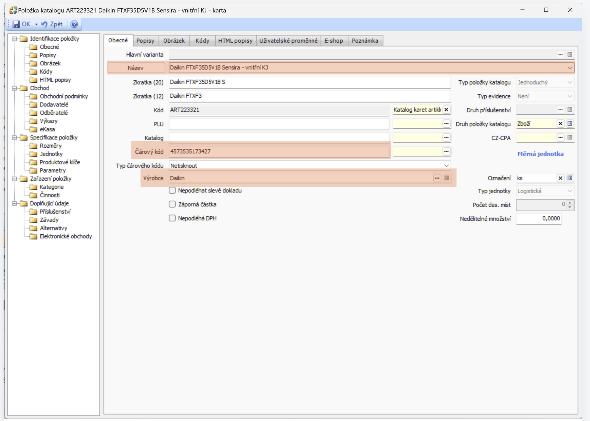

# Untitled

KATALOG

Pravidla ve zkratce

**Název karty** = **ZNAČKA** **TYP** **BARVA** **DETAILY**

**značka** = píšeme velkýma

**EAN =** když je, zadám ho. Když není, použiju ART číslo, nezačínám jej nulou

DPH

- standardně se karta vždy zakládá sama se základní sazbou DPH 21
- jiné sazby se používají při
    - potraviny (káva, DG) snížená 15
    - knihy 10
    - pojištění (allianz) 0

Máme tři levely kompletnosti karet

1. základní
    1. název
    2. EAN
    3. výrobce
2. použitelná
    1. obrázek
    2. kategorie
    3. popis
3. kompletní
    1. technické parametry
    2. příslušenství
    
    [https://www.figma.com/design/6adhAXZYhdr4KAlZHJaDKB/Untitled?node-id=0-1&t=A0ubZ58j3vME5VGn-1](https://www.figma.com/design/6adhAXZYhdr4KAlZHJaDKB/Untitled?node-id=0-1&t=A0ubZ58j3vME5VGn-1)
    

[https://www.canva.com/design/DAGSEDLfv_k/CoE47mU8pDj6ZH98pkuI9w/edit?utm_content=DAGSEDLfv_k&utm_campaign=designshare&utm_medium=link2&utm_source=sharebutton](https://www.canva.com/design/DAGSEDLfv_k/CoE47mU8pDj6ZH98pkuI9w/edit?utm_content=DAGSEDLfv_k&utm_campaign=designshare&utm_medium=link2&utm_source=sharebutton)

fsdfsdfsdfsd fsd fsdfsd

f sdfsdf sdfsd

f sdfsdf sdf sdf sdf sd

- fsdfsdfds
- fdsf dsf ds
- f dsfsdf sd

> f sdfdsfds fsd f sdf dsf sd
> 

---

fsdfsdfsd

f ds fsdf sd 

sdf sdfsd fsd