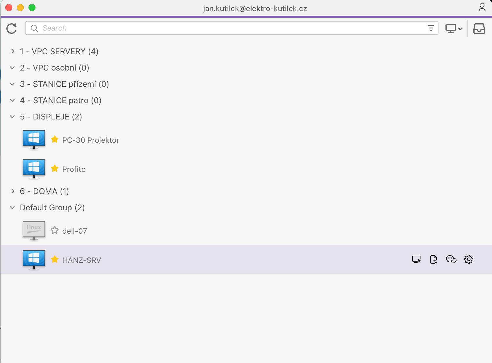

# Splashtop

<aside>
🔌

# Co to je ?

Aplikace na vzdálený přístup k PC

</aside>

<aside>
💡

# Princip

- dvě aplikace
    - server side
    - client side
- serverside se dělá jako instalation package a používáme tyto: [Linky na instalaci klienta](Splashtop%2011ada09689f380938f2ddf717f68094f.md)
- slientside se jmenuje “BusinessAccess” a je ke stažení zde:

**Instalátor pro Windows:**

[redirect.splashtop.com](https://redirect.splashtop.com/my/src/win?web_source=disabled&web_medium=disabled&page=disabled&platform=web)

**Ostatní instalátory zde na stránce**

[Splashtop Business Access Downloads: Start your Free Trial](https://www.splashtop.com/downloads/business)

</aside>

# Tvorba instalátorů

URL na správu 

[Splashtop: Secure Remote Access & Remote Support Software](https://www.splashtop.com/)

# Linky na instalaci klienta

<aside>

### Displeje

[Splashtop - Fast, Secure Remote Access](https://my.splashtop.eu/team_deployment/download/2WXL4LALY5ALEU)

</aside>

<aside>

### Servery

[Splashtop - Fast, Secure Remote Access](https://my.splashtop.eu/team_deployment/download/SZ4H4P3AKLYREU)

</aside>

<aside>

### VPC osobní

[Splashtop - Fast, Secure Remote Access](https://my.splashtop.eu/team_deployment/download/4T5STHWZ5SA4EU)

---

</aside>

<aside>

### Patro

[Splashtop - Fast, Secure Remote Access](https://my.splashtop.eu/team_deployment/download/R5SPAHRS7TRREU)

</aside>

<aside>

### Přízemí

[Splashtop - Fast, Secure Remote Access](https://my.splashtop.eu/team_deployment/download/JTA74ZT4ZLZXEU)

</aside>

# Postup nasazení klienta

1. stažení instalátoru
2. otevřít
3. Odklikat
4. V security vypneme “aditional password”
5. Aleš

# Ovládání

## Změna nastavení rozlišení

